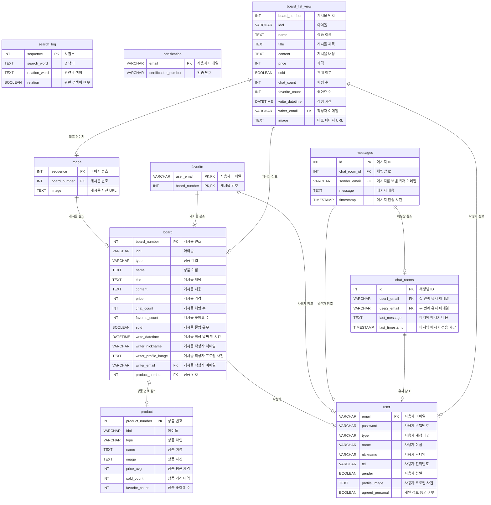
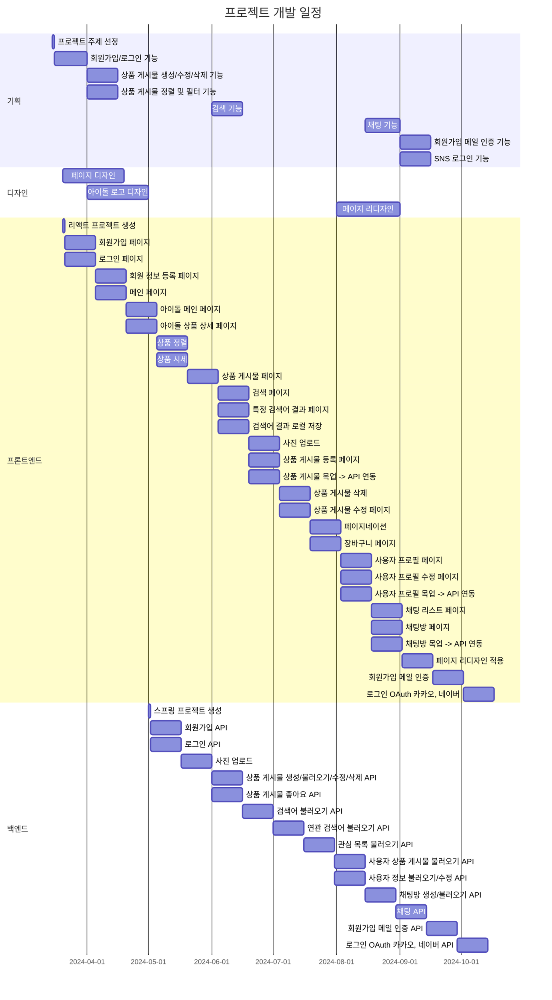

# 최애마켓 | ChoiaeMarket

K-pop 아이돌 팬들을 위한 **굿즈 중고거래 플랫폼**

## 목표와 기능

### 목표

- 아이돌 굿즈를 사고파는 중고거래 플랫폼
- 팬덤과의 소통과 상호작용을 위한, 팬들을 위한 플랫폼
- 아이돌 팬덤별 커뮤니티를 구축 및 맞춤 서비스를 제공하는 플랫폼
- 팬들이 직접 참여하고 키워가는 플랫폼
- 자신의 아이돌에 대한 애정과 가치를 다른 팬들과 공유하는 플랫폼

### 기능

- 아이돌 팬덤별 굿즈 분류를 통한 맞춤형 서비스
- 굿즈 실시간 판매 시세 제공
- 판매 게시물 등록 및 관리
- 실시간 채팅
  - 판매자와 구매자의 1대1 매칭
- SNS 계정을 통한 간단한 회원가입

## 기술 스택 및 의존성

### 기술 스택

- **UI/UX**: Figma
- **Frontend**: React
- **Backend**: Spring Boot
- **Database**: MySQL
- **Deployment**: AWS EC2 (예정)

### 프론트엔드 의존성

```
@stomp/stompjs               7.0.0
axios                        1.6.8
react                        18.2.0
react-cookie                 7.1.4
react-dom                    18.2.0
react-router-dom             6.14.2
sockjs-client                1.6.1
styled-components            6.0.7
styled-reset                 4.5.2
zustand                      4.5.2
```

### 백엔드 의존성

```
spring-boot-starter-data-jpa
spring-boot-starter-mail
spring-boot-starter-oauth2-client
spring-boot-starter-security
spring-boot-starter-validation
spring-boot-starter-web
spring-boot-starter-websocket
io.jsonwebtoken:jjwt-api     0.11.2
io.jsonwebtoken:jjwt-impl    0.11.2
io.jsonwebtoken:jjwt-jackson 0.11.2
```

## ERD 및 API 명세서

## ERD



### REST API 명세서

[최애마켓 REST API 명세서 - Notion 링크](https://nodb.notion.site/REST-API-59bcb52995f6445eb16b824847a8ae64?pvs=4)

## URL 구조

| URL                         | 설명                      | 로그인 권한 필요 |
| :-------------------------- | :------------------------ | :--------------: |
| /login                      | 로그인 페이지             |                  |
| /join                       | 회원가입 페이지           |                  |
| /register                   | 회원 정보 등록 페이지     |                  |
| /                           | 메인(아이돌 목록) 페이지  |        ✅        |
| /cart                       | 관심 목록 페이지          |        ✅        |
| /upload                     | 상품 게시물 등록 페이지   |        ✅        |
| /chat                       | 채팅방 목록 페이지        |        ✅        |
| /chat/{roomId}              | 채팅방 페이지             |        ✅        |
| /user/{user}                | 사용자 프로필 페이지      |        ✅        |
| /user/{user}/update         | 사용자 프로필 수정 페이지 |        ✅        |
| /search                     | 검색 페이지               |        ✅        |
| /search/{searchWord}        | 특정 검색어 결과 페이지   |        ✅        |
| /idol/{idol}                | 아이돌 메인 페이지        |        ✅        |
| /idol/{idol}/{product}      | 아이돌 상품 목록 페이지   |        ✅        |
| /board/{boardNumber}        | 상품 게시물 페이지        |        ✅        |
| /board/{boardNumber}/update | 상품 게시물 수정 페이지   |        ✅        |
| \*                          | 404 페이지                |                  |

## 프로젝트 구조와 개발 일정

### 프로젝트 구조

```
├── .eslintrc.cjs
├── .gitignore
├── index.html
├── package-lock.json
├── package.json
├── README.md
├── tsconfig.json
├── tsconfig.node.json
├── vite.config.ts
│
├── .vscode
│   └── settings.json
│
└── src
    ├── App.tsx
    ├── main.tsx
    ├── vite-env.d.ts
    │
    ├── apis
    │   ├── index.ts
    │   ├── request
    │   │   ├── auth
    │   │   │   ├── check-certification.request.dto.ts
    │   │   │   ├── email-certification.request.dto.ts
    │   │   │   ├── index.ts
    │   │   │   ├── sign-in.request.dto.ts
    │   │   │   └── sign-up.request.dto.ts
    │   │   ├── board
    │   │   │   ├── index.ts
    │   │   │   ├── patch-board.request.dto.ts
    │   │   │   └── post-board.request.dto.ts
    │   │   ├── chat
    │   │   │   └── post-chat-room.request.dto.ts
    │   │   └── user
    │   │       ├── index.ts
    │   │       ├── patch-profile-image.request.dto.ts
    │   │       └── patch-profile.request.dto.ts
    │   └── response
    │       ├── index.ts
    │       ├── response.dto.ts
    │       ├── auth
    │       │   ├── check-certification.response.dto.ts
    │       │   ├── email-certification.response.dto.ts
    │       │   ├── email-check.response.dto.ts
    │       │   ├── index.ts
    │       │   ├── sign-in.response.dto.ts
    │       │   └── sign-up.response.dto.ts
    │       ├── board
    │       │   ├── delete-board.response.dto.ts
    │       │   ├── get-board-list.response.dto.ts
    │       │   ├── get-board.response.dto.ts
    │       │   ├── get-favorite-board-list.response.dto.ts
    │       │   ├── get-favorite.response.dto.ts
    │       │   ├── get-search-board-list.response.dto.ts
    │       │   ├── get-user-board-list.response.dto.ts
    │       │   ├── index.ts
    │       │   ├── patch-board.response.dto.ts
    │       │   ├── post-board.response.dto.ts
    │       │   └── put-favorite.response.dto.ts
    │       ├── chat
    │       │   ├── get-chatroom-list.response.dto.ts
    │       │   ├── get-message.response.dto.ts
    │       │   ├── index.ts
    │       │   └── post-chat.response.dto.ts
    │       ├── search
    │       │   ├── get-popular-list.response.dto.ts
    │       │   ├── get-relation-list.response.ts
    │       │   └── index.ts
    │       └── user
    │           ├── get-sign-in-user.response.dto.ts
    │           ├── get-user.response.dto.ts
    │           ├── index.ts
    │           ├── patch-profile-image.response.dto.ts
    │           └── patch-profile.response.dto.ts
    │
    ├── assets
    │   ├── icon
    │   │   ├── back.png
    │   │   └── check.png
	│   │        .
    │   │        .
    │   ├── idol
    │   │   ├── cover
    │   │   │   ├── 8TURN.jpg
    │   │   │   └── AB6IX.jpg
    │   │   │        .
    │   │   │        .
    │   │   └── logo
    │   │   │   ├── 8TURN.jpg
    │   │   │   └── AB6IX.jpg
    │   │   │        .
    │   │   │        .
    │   ├── logo
    │   │   ├── logo.png
    │   │   └── logoWhite.png
    │   └── member
    │       └── default.png
    │
    ├── components
    │   ├── auth-components.ts
    │   ├── board-item.tsx
    │   ├── idolList.ts
    │   ├── loading-screen.tsx
    │   ├── navigation-bar.tsx
    │   ├── pagination.tsx
    │   ├── product-item.tsx
    │   └── protected-route.tsx
    │
    ├── hooks
    │   ├── index.ts
    │   └── pagination.hook.ts
    │
    ├── mocks
    │   ├── board-list.mock.ts
    │   ├── board.mock.ts
    │   ├── index.ts
    │   └── product-list.mock.ts
    │
    ├── routes
    │   ├── board.tsx
    │   ├── boardUpdate.tsx
    │   ├── cart.tsx
    │   ├── chat.tsx
    │   ├── chatRoom.tsx
    │   ├── detail.tsx
    │   ├── home.tsx
    │   ├── idol.tsx
    │   ├── join.tsx
    │   ├── login.tsx
    │   ├── oauth.tsx
    │   ├── register.tsx
    │   ├── search.tsx
    │   ├── searchWord.tsx
    │   ├── upload.tsx
    │   ├── userPage.tsx
    │   └── userUpdate.tsx
    │
    ├── services
    │   └── ChatService.ts
    │
    ├── stores
    │   └── login-user.store.ts
    │
    ├── types
    │   ├── enum
    │   │   ├── index.ts
    │   │   └── response-code.enum.ts
    │   └── interface
    │       ├── board-list-item.interface.ts
    │       ├── board.interface.ts
    │       ├── chatroom-list-item.interface.ts
    │       ├── favorite-list-item.interface.ts
    │       ├── favorite.interface.ts
    │       ├── index.ts
    │       ├── product-list-item.interface.ts
    │       └── user.interface.ts
    │
    └── utils
        └── index.ts

```

### 개발 일정



## 페이지별 기능

### [회원가입]

- 이메일 회원가입
- 프로필 설정

### [로그인]

- 이메일 로그인
- SNS 로그인

### [상하단 네이게이션바]

### [메인]

### [아이돌 메인]

### [아이돌 상품 목록]

### [검색]

### [검색 결과]

- 연관 검색어

### [관심 목록]

### [상품 등록]

### [상품 상세]

- 내 상품
- 상품 상세 페이지 수정
- 상품 상세 페이지 삭제

### [채팅 목록]

### [채팅방]

### [프로필]

- 내 프로필
- 다른 사용자 프로필

### [프로필 수정]

## 프론트엔드

### 사용자 인터페이스(UI)

- 홈 화면 : 인기 상품, 최신 상품, 추천 상품 등을 표시하는 카드 레이아웃
- 상품 목록 화면 : 카테고리별로 상품을 필터링하고 검색할 수 있는 인터페이스
- 상품 상세 화면 : 상품의 사진, 설명, 가격, 판매자 정보 등을 표시하는 페이지
- 사용자 프로필 화면 : 사용자 정보, 구매 내역, 판매 내역 등을 관리할 수 있는 페이지

### 사용자 경험(UX)

- 간편한 검색 및 필터링 기능을 제공하여 사용자가 원하는 상품을 쉽게 찾을 수 있도록 함
- 편리한 결제 시스템을 구현하여 사용자가 쉽고 안전하게 상품을 구매할 수 있도록 함
- 사용자 프로필을 통해 구매 내역과 판매 내역을 관리할 수 있는 기능을 제공함

### 기능 요구사항

- 상품 등록 및 수정 기능 : 판매자가 상품 정보를 등록하고 수정할 수 있도록 함
- 상품 검색 기능 : 상품명이나 카테고리로 상품을 검색할 수 있도록 함
- 사용자 인증 기능 : 회원가입, 로그인, 로그아웃 기능을 구현하여 사용자를 인증함

## 백엔드

### 데이터베이스 모델링

- 상품 정보를 저장할 데이터베이스 테이블을 설계함
- 사용자 정보와 사용자 세션 정보를 저장할 데이터베이스 테이블을 설계함
- 주문 정보를 저장할 데이터베이스 테이블을 설계함

### API 설계

- 상품 조회 API : 상품 목록을 반환하는 API를 구현함
- 상품 등록 및 수정 API : 판매자가 상품 정보를 등록하고 수정할 수 있도록 함
- 사용자 관리 API : 회원가입, 로그인, 로그아웃 기능을 제공하는 API를 구현함
- 주문 처리 AP I: 사용자가 상품을 구매할 때 주문 정보를 생성하고 결제를 처리하는 API를 구현함

### 보안 및 성능

- 사용자 인증 및 권한 부여 : 사용자 인증을 위한 보안 기능을 구현하고, 권한이 없는 사용자의 요청을 거부함.
- 데이터베이스 인덱싱 : 검색 및 필터링 기능의 성능을 향상시키기 위해 데이터베이스 인덱싱을 적절히 사용함.
- API 보안 : API 요청에 대한 인증 및 인가를 수행하여 보안을 강화함.

# 프로세스

### 등록

1. 카테고리 등록
2. 게시글 등록 + 이미지 업로드
3. 메일 알림 전송
4. 거래 상태 등록 (대기)

### 검색

1. 전체 게시글 검색
2. 키워드 검색
3. 키워드 + 필터 검색

### 구매

- 대화 → 예약 → 구매확정

1. 대화 - STOMP 방식을 통한 실시간 채팅
2. 예약 - 거래 상태 변경 (예약)
3. 메일 알림 전송
4. 구매 확정 - 거래 상태 변경 (승인)
5. 메일 알림 전송

### 삭제

1. 게시글 삭제
2. 이미지 삭제
3. 거래 상태 삭제

## 에러

## 개선 목표

구매 프로세스 구축

- 채팅 → 예약 → 구매확정

1. 실시간 채팅방을 통한 예약
2. 게시물 상태 변경 (일반 → 예약)
3. 구매 후 게시물 상태 변경 (예약 → 확정)

## 느낀점

## 개발자

<div align="center">

|                                                          **노다빈**                                                          |
| :--------------------------------------------------------------------------------------------------------------------------: |
| [ <br/> @nodb](https://github.com/nodb) |
|                                                       FE │ BE │ UI/UX                                                        |

</div>

## 라이선스

이 프로젝트는 MIT 라이선스로 배포됩니다.
상세한 라이선스 정보는 LICENSE 파일에서 확인할 수 있습니다.
