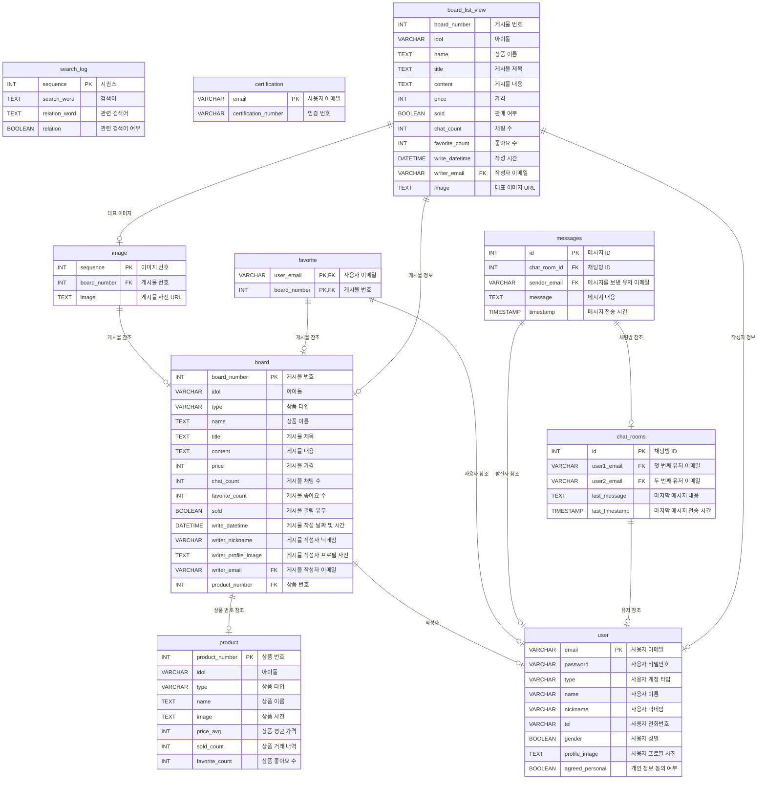
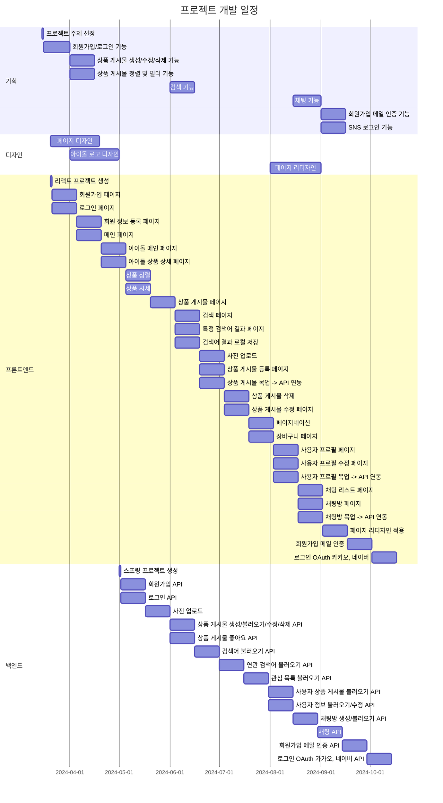

# 최애마켓 | ChoiaeMarket


K-pop 아이돌 팬들을 위한 **굿즈 중고거래 플랫폼**

## 목표

- 아이돌 굿즈를 사고파는 중고거래 플랫폼
- 팬덤과의 소통과 상호작용을 위한, 팬들을 위한 플랫폼
- 아이돌 팬덤별 커뮤니티를 구축 및 맞춤 서비스를 제공하는 플랫폼
- 팬들이 직접 참여하고 키워가는 플랫폼
- 자신의 아이돌에 대한 애정과 가치를 다른 팬들과 공유하는 플랫폼

## 기능

- 아이돌 팬덤별 굿즈 분류를 통한 맞춤형 서비스
- 굿즈 실시간 판매 시세 제공
- 판매 게시물 등록 및 관리
- 실시간 채팅
  - 판매자와 구매자의 1대1 매칭
- SNS 계정을 통한 간단한 회원가입

## 기술 스택

- **UI/UX**: Figma
- **Frontend**: React
- **Backend**: Spring Boot
- **Database**: MySQL
- **Deployment**: AWS EC2 (예정)

## 의존성

### 프론트엔드 의존성

```
@stomp/stompjs               7.0.0
axios                        1.6.8
react                        18.2.0
react-cookie                 7.1.4
react-dom                    18.2.0
react-router-dom             6.14.2
sockjs-client                1.6.1
styled-components            6.0.7
styled-reset                 4.5.2
zustand                      4.5.2
```

### 백엔드 의존성

```
spring-boot-starter-data-jpa
spring-boot-starter-mail
spring-boot-starter-oauth2-client
spring-boot-starter-security
spring-boot-starter-validation
spring-boot-starter-web
spring-boot-starter-websocket
io.jsonwebtoken:jjwt-api     0.11.2
io.jsonwebtoken:jjwt-impl    0.11.2
io.jsonwebtoken:jjwt-jackson 0.11.2
```

## ERD



## REST API 명세서

[최애마켓 REST API 명세서 - Notion 링크](https://nodb.notion.site/REST-API-59bcb52995f6445eb16b824847a8ae64?pvs=4)

## URL 구조

| URL                         | 설명                      | 로그인 권한 필요 |
| :-------------------------- | :------------------------ | :--------------: |
| /login                      | 로그인 페이지             |                  |
| /join                       | 회원가입 페이지           |                  |
| /register                   | 회원 정보 등록 페이지     |                  |
| /                           | 메인(아이돌 목록) 페이지  |        ✅        |
| /cart                       | 관심 목록 페이지          |        ✅        |
| /upload                     | 상품 게시물 등록 페이지   |        ✅        |
| /chat                       | 채팅방 목록 페이지        |        ✅        |
| /chat/{roomId}              | 채팅방 페이지             |        ✅        |
| /user/{user}                | 사용자 프로필 페이지      |        ✅        |
| /user/{user}/update         | 사용자 프로필 수정 페이지 |        ✅        |
| /search                     | 검색 페이지               |        ✅        |
| /search/{searchWord}        | 특정 검색어 결과 페이지   |        ✅        |
| /idol/{idol}                | 아이돌 메인 페이지        |        ✅        |
| /idol/{idol}/{product}      | 아이돌 상품 목록 페이지   |        ✅        |
| /board/{boardNumber}        | 상품 게시물 페이지        |        ✅        |
| /board/{boardNumber}/update | 상품 게시물 수정 페이지   |        ✅        |
| \*                          | 404 페이지                |                  |

## 프로젝트 구조

### 프론트엔드 프로젝트 구조

[프론트엔드 깃허브](https://github.com/ChoiaeMarket/ChoiaeMarket_Web)

```
├── .eslintrc.cjs
├── .gitignore
├── index.html
├── package-lock.json
├── package.json
├── README.md
├── tsconfig.json
├── tsconfig.node.json
├── vite.config.ts
│
├── .vscode
│   └── settings.json
│
└── src
    ├── App.tsx
    ├── main.tsx
    ├── vite-env.d.ts
    │
    ├── apis
    │   ├── index.ts
    │   ├── request
    │   │   ├── auth
    │   │   │   ├── check-certification.request.dto.ts
    │   │   │   ├── email-certification.request.dto.ts
    │   │   │   ├── index.ts
    │   │   │   ├── sign-in.request.dto.ts
    │   │   │   └── sign-up.request.dto.ts
    │   │   ├── board
    │   │   │   ├── index.ts
    │   │   │   ├── patch-board.request.dto.ts
    │   │   │   └── post-board.request.dto.ts
    │   │   ├── chat
    │   │   │   └── post-chat-room.request.dto.ts
    │   │   └── user
    │   │       ├── index.ts
    │   │       ├── patch-profile-image.request.dto.ts
    │   │       └── patch-profile.request.dto.ts
    │   └── response
    │       ├── index.ts
    │       ├── response.dto.ts
    │       ├── auth
    │       │   ├── check-certification.response.dto.ts
    │       │   ├── email-certification.response.dto.ts
    │       │   ├── email-check.response.dto.ts
    │       │   ├── index.ts
    │       │   ├── sign-in.response.dto.ts
    │       │   └── sign-up.response.dto.ts
    │       ├── board
    │       │   ├── delete-board.response.dto.ts
    │       │   ├── get-board-list.response.dto.ts
    │       │   ├── get-board.response.dto.ts
    │       │   ├── get-favorite-board-list.response.dto.ts
    │       │   ├── get-favorite.response.dto.ts
    │       │   ├── get-search-board-list.response.dto.ts
    │       │   ├── get-user-board-list.response.dto.ts
    │       │   ├── index.ts
    │       │   ├── patch-board.response.dto.ts
    │       │   ├── post-board.response.dto.ts
    │       │   └── put-favorite.response.dto.ts
    │       ├── chat
    │       │   ├── get-chatroom-list.response.dto.ts
    │       │   ├── get-message.response.dto.ts
    │       │   ├── index.ts
    │       │   └── post-chat.response.dto.ts
    │       ├── search
    │       │   ├── get-popular-list.response.dto.ts
    │       │   ├── get-relation-list.response.ts
    │       │   └── index.ts
    │       └── user
    │           ├── get-sign-in-user.response.dto.ts
    │           ├── get-user.response.dto.ts
    │           ├── index.ts
    │           ├── patch-profile-image.response.dto.ts
    │           └── patch-profile.response.dto.ts
    │
    ├── assets
    │   ├── icon
    │   │   ├── back.png
    │   │   └── check.png
    │   │        .
    │   │        .
    │   ├── idol
    │   │   ├── cover
    │   │   │   ├── 8TURN.jpg
    │   │   │   └── AB6IX.jpg
    │   │   │        .
    │   │   │        .
    │   │   └── logo
    │   │   │   ├── 8TURN.jpg
    │   │   │   └── AB6IX.jpg
    │   │   │        .
    │   │   │        .
    │   ├── logo
    │   │   ├── logo.png
    │   │   └── logoWhite.png
    │   └── member
    │       └── default.png
    │
    ├── components
    │   ├── auth-components.ts
    │   ├── board-item.tsx
    │   ├── idolList.ts
    │   ├── loading-screen.tsx
    │   ├── navigation-bar.tsx
    │   ├── pagination.tsx
    │   ├── product-item.tsx
    │   └── protected-route.tsx
    │
    ├── hooks
    │   ├── index.ts
    │   └── pagination.hook.ts
    │
    ├── mocks
    │   ├── board-list.mock.ts
    │   ├── board.mock.ts
    │   ├── index.ts
    │   └── product-list.mock.ts
    │
    ├── routes
    │   ├── board.tsx
    │   ├── boardUpdate.tsx
    │   ├── cart.tsx
    │   ├── chat.tsx
    │   ├── chatRoom.tsx
    │   ├── detail.tsx
    │   ├── home.tsx
    │   ├── idol.tsx
    │   ├── join.tsx
    │   ├── login.tsx
    │   ├── oauth.tsx
    │   ├── register.tsx
    │   ├── search.tsx
    │   ├── searchWord.tsx
    │   ├── upload.tsx
    │   ├── userPage.tsx
    │   └── userUpdate.tsx
    │
    ├── services
    │   └── ChatService.ts
    │
    ├── stores
    │   └── login-user.store.ts
    │
    ├── types
    │   ├── enum
    │   │   ├── index.ts
    │   │   └── response-code.enum.ts
    │   └── interface
    │       ├── board-list-item.interface.ts
    │       ├── board.interface.ts
    │       ├── chatroom-list-item.interface.ts
    │       ├── favorite-list-item.interface.ts
    │       ├── favorite.interface.ts
    │       ├── index.ts
    │       ├── product-list-item.interface.ts
    │       └── user.interface.ts
    │
    └── utils
        └── index.ts

```

### 백엔드 프로젝트 구조

[백엔드 깃허브](https://github.com/ChoiaeMarket/ChoiaeMarket_Server)

```
├── .gitignore
├── build.gradle
├── gradlew
├── gradlew.bat
├── README.md
├── settings.gradle
│
├── .gradle
│    .
│    .
│
├── .vscode
│   └── settings.json
│
└── src─
    └── main
        ├── java
        │   └── com
        │       └── choiaemarket
        │           └── choiaemarket_server
        │               ├── ChoiaemarketServerApplication.java
        │               │
        │               ├── common
        │               │   ├── CertificationNumber.java
        │               │   ├── ResponseCode.java
        │               │   └── ResponseMessage.java
        │               │
        │               ├── config
        │               │   ├── WebSecurityConfig.java
        │               │   └── WebSocketConfig.java
        │               │
        │               ├── controller
        │               │   ├── AuthController.java
        │               │   ├── BoardController.java
        │               │   ├── ChatController.java
        │               │   ├── FileController.java
        │               │   ├── SearchController.java
        │               │   └── UserController.java
        │               │
        │               ├── dto
        │               │   ├── message
        │               │   │   └── ChatMessage.java
        │               │   │
        │               │   ├── object
        │               │   │   ├── BoardListItem.java
        │               │   │   ├── FavoriteListItem.java
        │               │   │   └── ProductListItem.java
        │               │   │
        │               │   ├── request
        │               │   │   ├── auth
        │               │   │   │   ├── CheckCertificationRequestDto.java
        │               │   │   │   ├── EmailCertificationRequestDto.java
        │               │   │   │   ├── SignInRequestDto.java
        │               │   │   │   └── SignUpRequestDto.java
        │               │   │   │
        │               │   │   ├── board
        │               │   │   │   ├── PatchBoardRequestDto.java
        │               │   │   │   └── PostBoardRequestDto.java
        │               │   │   │
        │               │   │   ├── chat
        │               │   │   │   └── PostChatRoomRequestDto.java
        │               │   │   │
        │               │   │   └── user
        │               │   │       ├── PatchProfileImageRequestDto.java
        │               │   │       └── PatchProfileRequestDto.java
        │               │   │
        │               │   └── response
        │               │       ├── ResponseDto.java
        │               │       │
        │               │       ├── auth
        │               │       │   ├── CheckCertificationResponseDto.java
        │               │       │   ├── EmailCertificationResponseDto.java
        │               │       │   ├── EmailCheckResponseDto.java
        │               │       │   ├── SignInResponseDto.java
        │               │       │   └── SignUpResponseDto.java
        │               │       │
        │               │       ├── board
        │               │       │   ├── DeleteBoardResponseDto.java
        │               │       │   ├── GetBoardResponseDto.java
        │               │       │   ├── GetFavoriteBoardListResponseDto.java
        │               │       │   ├── GetFavoriteResponseDto.java
        │               │       │   ├── GetLatestBoardListResponseDto.java
        │               │       │   ├── GetSearchBoardListResponseDto.java
        │               │       │   ├── GetUserBoardListResponseDto.java
        │               │       │   ├── PatchBoardResponseDto.java
        │               │       │   ├── PostBoardResponseDto.java
        │               │       │   └── PutFavoriteResopnseDto.java
        │               │       │
        │               │       ├── chat
        │               │       │   ├── GetChatRoomListResponseDto.java
        │               │       │   ├── GetMessageResponseDto.java
        │               │       │   └── PostChatRoomResponseDto.java
        │               │       │
        │               │       ├── search
        │               │       │   ├── GetPopularListResponseDto.java
        │               │       │   └── GetRelationListResponseDto.java
        │               │       │
        │               │       └── user
        │               │           ├── GetSignInUserResponseDto.java
        │               │           ├── GetUserResponseDto.java
        │               │           ├── PatchProfileImageResponseDto.java
        │               │           └── PatchProfileResponseDto.java
        │               │
        │               ├── entity
        │               │   ├── BoardEntity.java
        │               │   ├── BoardListViewEntity.java
        │               │   ├── CertificationEntity.java
        │               │   ├── ChatEntity.java
        │               │   ├── ChatRoomEntity.java
        │               │   ├── CustomOAuth2User.java
        │               │   ├── FavoriteEntity.java
        │               │   ├── ImageEntity.java
        │               │   ├── MessageEntity.java
        │               │   ├── ProductEntity.java
        │               │   ├── SearchLogEntity.java
        │               │   ├── UserEntity.java
        │               │   │
        │               │   └── primaryKey
        │               │       ├── ChatPk.java
        │               │       └── FavoritePk.java
        │               │
        │               ├── exception
        │               │   └── BadRequestExceptionHandler.java
        │               │
        │               ├── filter
        │               │   └── JwtAuthenticationFilter.java
        │               │
        │               ├── handler
        │               │   ├── OAuth2SuccessHandler.java
        │               │   └── ValidationExceptionHandler.java
        │               │
        │               ├── provider
        │               │   ├── EmailProvider.java
        │               │   └── JwtProvider.java
        │               │
        │               ├── repository
        │               │   ├── BoardListViewRepository.java
        │               │   ├── BoardRepository.java
        │               │   ├── CertificationRepository.java
        │               │   ├── ChatRepository.java
        │               │   ├── ChatRoomRepository.java
        │               │   ├── FavoriteRepository.java
        │               │   ├── ImageRepository.java
        │               │   ├── MessageRepository.java
        │               │   ├── ProductRepository.java
        │               │   ├── SearchLogRepository.java
        │               │   ├── UserRepository.java
        │               │   │
        │               │   └── resultSet
        │               │       ├── GetPopularListResultSet.java
        │               │       └── GetRelationListResultSet.java
        │               │
        │               └── service
        │                   ├── AuthService.java
        │                   ├── BoardService.java
        │                   ├── ChatRoomService.java
        │                   ├── FileService.java
        │                   ├── MessageService.java
        │                   ├── SearchService.java
        │                   ├── UserService.java
        │                   │
        │                   └── implement
        │                       ├── AuthServiceImplement.java
        │                       ├── BoardServiceImplement.java
        │                       ├── ChatRoomServiceImplement.java
        │                       ├── FileServiceImplement.java
        │                       ├── MessageServiceImplement.java
        │                       ├── OAuth2UserServiceImplement.java
        │                       ├── SearchServiceImplement.java
        │                       └── UserServiceImplement.java
        │
        └── resources
            └── application.properties
```

## 개발 일정



## 페이지별 기능

### [회원가입]

- 이메일 주소를 입력하면 입력창에서 유효성 검사 진행(중복 불가)
  - 통과하지 못하면 경고 문구 출력
- 이메일 인증 버튼을 클릭하면 해당 이메일 주소로 인증 번호 전송
- 인증 번호를 입력 후 인증 확인을 클릭하면 유효성 검사 진행
  - 통과하지 못하면 경고 문구 출력

| 회원가입                                                                                                    |
| ----------------------------------------------------------------------------------------------------------- |
|  |

### [프로필 설정]

- 비밀번호, 이름, 프로필명, 전화번호, 성별, 프로필 사진 입력
- 이메일은 변경 불가 → 아이디로 사용
- 비밀번호는 8~20자리, 숫자/영문자[대소구분]
- 프로필 사진은 등록하지 않을 경우 기본 이미지
- 프로필명과 전화번호은 유효성 검사 진행(중복 불가)
  - 통과하지 못하면 경고 문구 출력

| 프로필 설정                                                                                                 |
| ----------------------------------------------------------------------------------------------------------- |
|  |

### [로그인]

- 이메일과 비밀번호를 입력하고 로그인 버튼을 클릭하면 유효성 검사 진행
  - 통과하지 못하면 경고 문구 출력
  - 로그인에 성공하면 메인 화면으로 이동

| 로그인                                                                                                      |
| ----------------------------------------------------------------------------------------------------------- |
|  |

### [카카오 로그인]

- 카카오 버튼을 클릭하면 카카오 로그인에 진입
- 카카오 로그인 성공시 토큰을 발행하고 이메일, 이름, 닉네임,
- 전화번호, 성별을 제공 받아 데이터베이스에 저장
  - 이메일은 “kakao\_이메일 앞 부분”의 형태로 저장
- 이후 프로필 수정에서 변경 가능

| 카카오 로그인                                                                                               |
| ----------------------------------------------------------------------------------------------------------- |
|  |

### [네이버 로그인]

- 네이버 버튼을 클릭하면 네이버 로그인에 진입
- 네이버 로그인 성공시 토큰을 발행하고 이메일, 이름, 닉네임,
- 전화번호, 성별을 제공 받아 데이터베이스에 저장
  - 이메일은 “naver\_이메일 앞 부분”의 형태로 저장
- 이후 프로필 수정에서 변경 가능

| 네이버 로그인                                                                                               |
| ----------------------------------------------------------------------------------------------------------- |
|  |

### [메인]

- 로그인 성공시 가장 처음에 뜨는 화면
- 상하단 네이게이션바와 아이돌 로고로 구성
- 아이돌 로고 및 이름 클릭시 해당 아이돌 페이지로 진입

| 메인                                                                                                        |
| ----------------------------------------------------------------------------------------------------------- |
|  |

### [네비게이션바]

- 상단 네비게이션 바
  - 검색
  - 알림
  - 공유
  - 수정/삭제
  - (페이지마다 다름)
- 하당 네비게이션 바
  - 메인
  - 관심 목록
  - 게시물 등록
  - 채팅 목록
  - 프로필

| 네비게이션바                                                                                                |
| ----------------------------------------------------------------------------------------------------------- |
|  |

### [아이돌 메인]

- 상품 목록
  - 종류에 따른 필터
  - 정렬(최신, 저가, 찜)
- 상품 목록 클릭시 해당 상품 페이지로 진입

| 아이돌 메인                                                                                                 |
| ----------------------------------------------------------------------------------------------------------- |
|  |

### [아이돌 상품 목록]

- 상품 게시물
  - 평균 상품 가격
  - 상품 등록 개수
  - 정렬(최신, 저가, 찜)
- 게시물 클릭시 해당 상품 게시물 페이지로 진입

| 아이돌 상품 목록                                                                                            |
| ----------------------------------------------------------------------------------------------------------- |
|  |

### [상품 게시물]

- 상품 정보
  - 이미지
  - 상품 종류
  - 제목
  - 내용
  - 가격
  - 게시 시간
- 유저 클릭시 유저 프로필로 이동
- 좋아요 버튼 클릭시 관심 목록에 추가
  - 다시 누르면 제거
- 채팅 버튼 클릭시 채팅방 생성 및 진입
  - 기존에 있는 방일 경우 해당 방으로 진입

| 상품 게시물                                                                                                 |
| ----------------------------------------------------------------------------------------------------------- |
|  |

### [관심 목록]

- 좋아요 누른 상품 게시물 목록
- 게시물 클릭시 해당 상품 게시물 페이지로 진입

| 관심 목록                                                                                                   |
| ----------------------------------------------------------------------------------------------------------- |
|  |

### [상품 등록]

- 상품 정보
  - 이미지
  - 아이돌
  - 카테고리
  - 상품명
  - 제목
  - 상세 설명
  - 가격
- 등록하기 버튼 클릭시 등록 후 해당 상품 목록 페이지로 진입

| 상품 등록                                                                                                   |
| ----------------------------------------------------------------------------------------------------------- |
|  |

### [상품 수정]

- 로그인된 이메일과 상품 게시물 등록한 이메일을 통해 유효성 검사 진행 후 상단 네비게이션 바에 수정/삭제 목록 표시
- 상품 등록 페이지와 동일하게 필수 입력
- 수정하기 버튼 클릭시 수정 후 해당 상세 페이지로 진입

| 상품 수정                                                                                                   |
| ----------------------------------------------------------------------------------------------------------- |
|  |

### [상품 삭제]

- 게시물을 삭제 후 메인 페이지로 진입

| 상품 삭제                                                                                                   |
| ----------------------------------------------------------------------------------------------------------- |
|  |

### [채팅방]

- 게시물을 게시한 유저와 실시간 1대1 채팅방 생성
  - 기존에 생성된 방일 경우 해당 방으로 진입
  - 채팅 목록에 방 생성
- 채팅을 치지 않고 나올 경우 채팅 목록에서 삭제

| 채팅방                                                                                                      |
| ----------------------------------------------------------------------------------------------------------- |
|  |

### [채팅 목록]

- 생성된 채팅방 목록
- 채팅방 클릭시 해당 채팅방에서의 기존 채팅 불러오기

| 채팅 목록                                                                                                   |
| ----------------------------------------------------------------------------------------------------------- |
|  |

### [프로필]

- 로그인된 이메일과 프로필의 이메일을 통해 유효성 검사 진행 후 프로필 편집 및 로그아웃 버튼 생성
- 판매 상품 목록 출력
- 프로필 편집
  - 이름, 이메일 수정 불가
  - 닉네임, 전화번호 수정 가능, 중복 불가(유효성 검사)
  - 프로필 사진 수정 가능, 중복 가능
  - 통과하지 못하면 경고 문구 출력

| 프로필                                                                                                      |
| ----------------------------------------------------------------------------------------------------------- |
|  |

### [다른 유저 프로필]

- 해당 유저의 판매 상품 목록 출력

| 다른 유저 프로필                                                                                            |
| ----------------------------------------------------------------------------------------------------------- |
|  |

### [검색]

- 검색
  - 최근 검색어
- 검색 결과
  - 연관 검색어
  - 검색 상품 목록
  - (검색어가 포함된 아이돌, 카테고리, 상품명, 제목, 상세 내용)
- 검색시 최근 검색어에 추가
- 연달아 검색시 연관 검색어 데이터베이스에 저장

| 검색                                                                                                        |
| ----------------------------------------------------------------------------------------------------------- |
|  |

## 개발자

<div align="center">

|                                                          **노다빈**                                                          |
| :--------------------------------------------------------------------------------------------------------------------------: |
| [ <br/> @nodb](https://github.com/nodb) |
|                                                       FE │ BE │ UI/UX                                                        |

</div>

## 라이선스

이 프로젝트는 MIT 라이선스로 배포됩니다.
상세한 라이선스 정보는 LICENSE 파일에서 확인할 수 있습니다.
